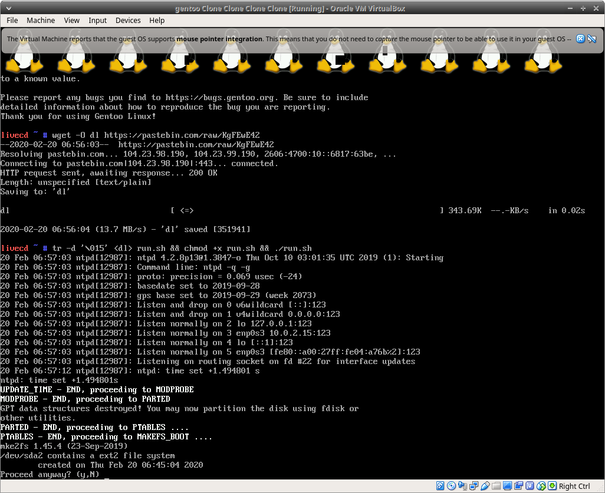
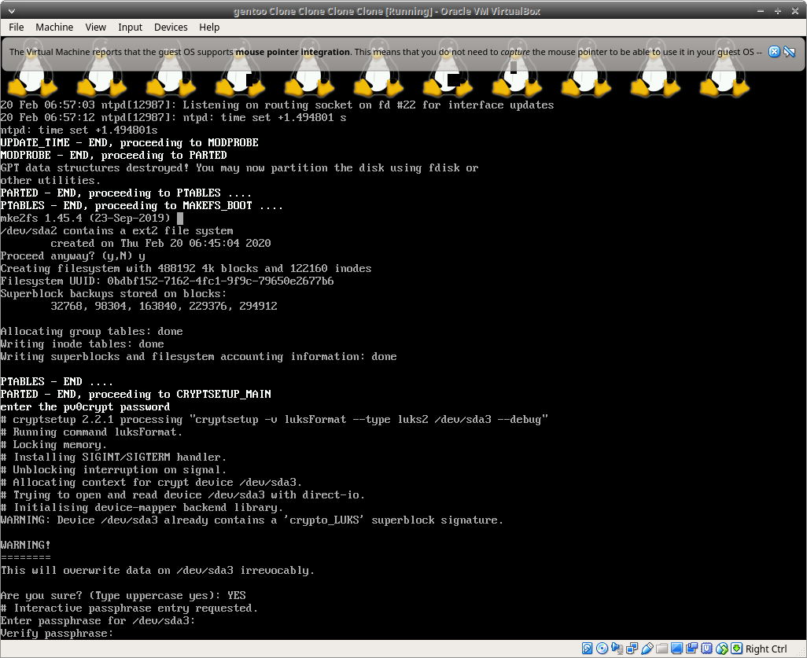
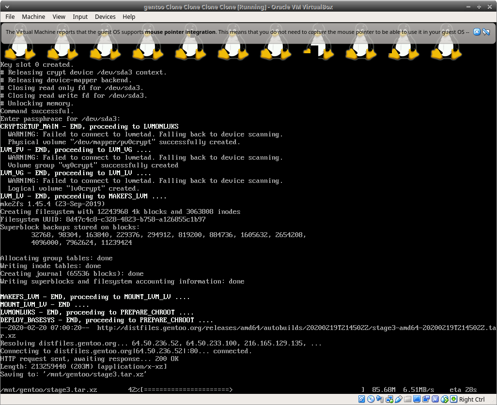
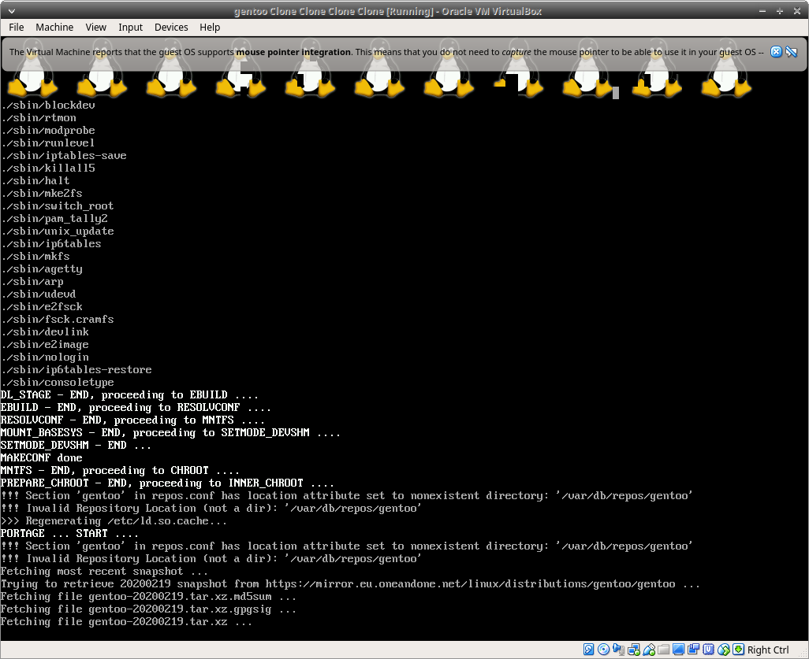
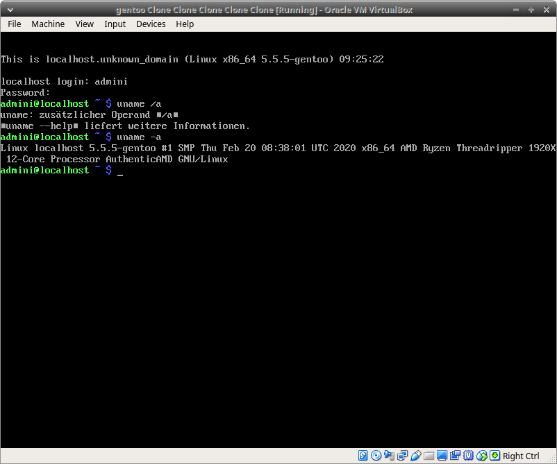

# Automated 1 file setup GENTOO linux

### status alpha ... desktop env setup missing .. base setup boots as of ß2.06.20
> all infos in the script file!

-  Intended as fully or "mostly fully ;)" unattended modular gentoo initial setup blueprint in a SINGLE file for easy cp, curl or however you want to deploy it - no thirdparty tools are required - bash shell == ready to go to chroot, with a few script settings and little stress to a fully customized, replicable gentoo setup.
note: index needs to be updated.

Format: 

Format: 

Format: 

Format: 

Format: 
