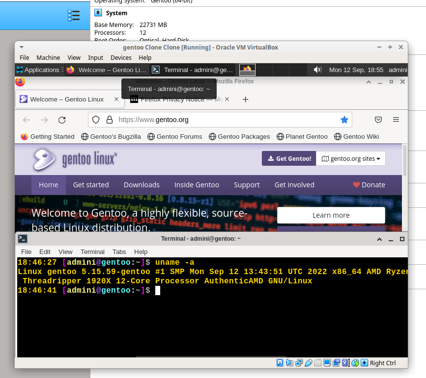

# Automated modular GENTOO linux setup

# status 14.09.2022 - no full test but "should work" - lvm solo & cryptsetup booted after basic setup wo desktop... testing...:
> changes: adapt option to make cryptsetup an option and lvm on root another, split variables / functions in sub files, add start / stop notice per function ...
> ..edit readme to reflect basic default setup info.

- 12.09.22 commit workign tested cryptsetup, boots to desktop - screenshot 12.09.22
> ... no err, script runs through - enter passwords cryptsetup, confirm kernel config in menuconfig, enter userpass end - done...
 functions may be commented out for chroot ...

- testing optionable cryptsetup / lvm on root ... pure root setup to be setup... make everything modular option without interferrence in the main setup.
> boots to desktop xfce -> firefox, network, audio ...
> no significant errors, logs attached log dir (exc 12.09.22)
> adding core apps.
- tidy, sort script to match gentoo categories.
- PRESET_ACCEPT_KEYWORDS="amd64" # build 8.9.22 "amd64 ~amd64" - build 7.9.22 # ~amd64" # alone not tested yet # all on profile 1
> testing ... functions may but commented out ;)
- work / redo / TESTING all the things ... things maybe not ordered neatley yet.
- basic mockup, work in progress
- script runs with "very little" interaction required to setup a gentoo desktop. ... testing
- bugs that prevented the script to run to the finish (desktop environment) removed ... xfce deskop boots.

DOCS: https://github.com/alphaaurigae/gentoo_unattented-setup/tree/master/doc

> 
screen

## Default (main testing)
- OPENRC

### PRE

#### partitioning
- sda single drive setup (240gb on test, may use way less...)
- sda1 bios boot
- sda2 bios boot - fs ext2
- sda3 main part - fs ext4 - lvm on cryptsetup or alt lvm on root

#### stage3 load
- curl off http://distfiles.gentoo.org/releases/amd64/autobuilds/
- gpg verify and print err if. 
- unpack to chroot

#### prep chroot
- copy files for chroot

### CHROOT
#### BASE
- SWAPFILE - 50gb + 28gb test vm ram
- MAKECONF 
- CONF_LOCALES
- PORTAGE
- ESELECT_PROFILE - 1 stable
- EMERGE_ATWORLD
- SYSTEMTIME - openntpd
- KEYMAP_CONSOLEFONT - def /etc/conf.d/keymaps, /etc/conf.d/consolefont, x11 X11/xorg.conf.d/10-keyboard.conf - dracut load for cryptset.
- FIRMWARE - linux firware default gentoo
- CP_BASHR

#### CORE
- FSTAB
- SYSFS = DMCRYPT, LVM, MULTIPATH
- FSTOOLS = ext2
- SUDO
- SYSLOG - syslogng
- SYSAPP - pciutils, mlocate
- APP - gnupg
- SYSPROCESS, CRON cronie (unfinished set, TOP
- KERNEL - gentoo-sources , premade config for vm cryptsetup
- INITRAM - dracut
- BOOTLOADER grub2 - osprober
- EMULATION - virtualbox guest add (test on virtualbox kvm setting)
- SOUND_API - alsa
- SOUND_SERVER jack2, pulseaudio
- SOUND_MIXER pavucontrol
- GPU - virtualbox guest
- NET_MGMT, netirfc, dhcpcd, networkmanager
- NET_FIREWALL - iptables

#### SCREENDSP
- WINDOWSYS - x11
- DESKTOP_ENV - xfce4
- MGR - LXDM

#### USERAPP - git, firefox

# USERS
- add admin, add requ groups
