# Automated, modular - 1 file - setup for GENTOO linux.

- find the configs in "config/required/default-testing/" , eventually edit and paste to the main script "run.sh" --> in place of " [ !PASTE_DEF_CONFIG ... ] "
> there are 3 places for default configs / variables to be copy pasted.
1. !PASTE_DEF_CONFIG copy paste content of "config/required/default-testing/1_ variables_pre.default-testing.sh" --> TO: "run.sh --> EDITOR [ !PASTE_DEF_CONFIG VARIABLES_1 ...]
- variables for the pre setup.
2. !PASTE_DEF_CONFIG copy paste content of "2_variables_chroot_default-testing.sh" --> TO: "run.sh" --> EDITOR [ !PASTE_DEF_CONFIG VARIABLES_2 ...]
- combined with the variables for the pre setup .. these setup everything for the chroot.
3. !PASTE_DEF_CONFIG copy paste content of "kernel_.config_default-testing.sh (template of /usr/src/linux/.config" to be pasted during setup) --> TO: "run.sh" --> EDITOR [ !PASTE_DEF_CONFIG the linux kernel configuration file (there are options to work off default configs - see var)
- you still get a menuconfig by default, but based on the premade config. there are more optiosn for kernel setup.

- work in progress! 24.01.2021# Automated, modular - 1 file - setup for GENTOO linux.

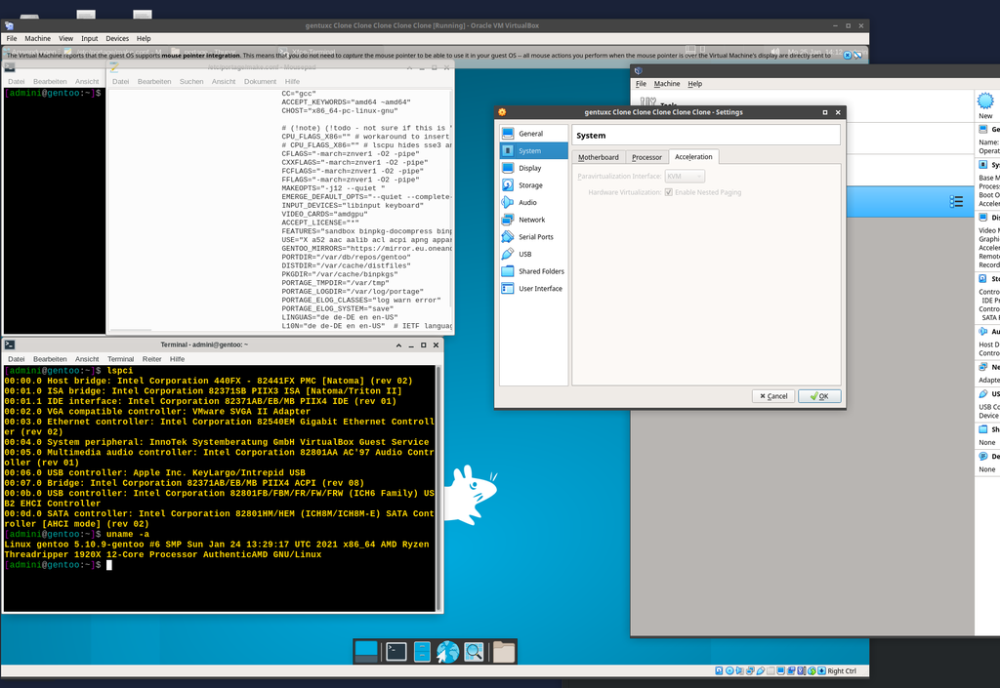

> work in progress! 24.01.2021
- minimal default kernel configuration - automate kernel functions set y/n . probably different default kernels .. testing..
- grub timeout font? kernel title? kernel font? idk
- keyboard .. after chroot reboot into new system the keyboard is still default in xfce4
- tidy up 
- modulize ... automate all the things.... ; modulize partitions, useflags ... all the things.
- IOMMU for virt?
- improve readability.
- improve default build time and script time (avoid reconfigs @world)

 > 1 file configurable setup script for a automated - unattended & modular gentoo linux system installation. 

 > https://github.com/alphaaurigae/gentoo_unattented-setup

> quick virt setup for testing:

- virt-manager KVM qemu yet todo for testing, virtualbox was quick and "easy".

## virtualbox
> Virtualbox (v6.*) Test Deployment Instructions, "3 steps": (!NOTE: see  readme.md / img fold for GUI settings. Virtualbox 6.* or higher)
### I:
1. config variables - default settings should do for a testrun.
2. IF VIRT GUEST may w sufficient RAM (test system has 32G RAM, where 25 are for the guest) and possibly KVM to avoid flag conflics (!NOTE: ex firefox avx2 err).

### II:
#### sample 1:
1. deploy virtualbox gentoo minimal ISO
2. wget -O awesome.sh https://....
3. tr -d '\015' < awesome.sh > deploy-gentoo.sh # convert to unix file format, in case the host deploys it differently.

#### sample 2:
1. deploy virtualbox gentoo minimal ISO
2. depending on the network change virtualbox network adapter settings - sample here has host with bridge and guest with bridged adapter,
3. passwd root
4. run ssh serv
5. scp gentoo_unattented_modular-setup.sh root@x.x.x.x:run.sh

### III:
1. chmod +x run.sh
2. prepare to be prompted for cryptsetup password setup, youll need this a little later to unlock the luks container for the CHROOT!. see relevant sections for details.
3. have dinner, this may take a long while.
4. kernel setup will require interaction! w the default setup the included config (cryptsetup settings included) will be parsed and updated with menuconfig. make changes and save ,(!NOTE: youll also be prompted for kernel updates not included in the config yet - hit yes ffor default values)
5. this may take another while, desktop and apps will be installed before the next stop. may have another dinner - firefox alone takes 40 minutes on a ryzen threadripper 1920x to build.
6. user password will be asked for the future root and admin (user) account.

> !IMPORTANT
1.0 SECTIONS: depending on variables set all kinds of bad things can happen which may lead to a failure of the entire installation - thats a true pity if you waited a couple of hours. ... ->
1.1 ... for this reason its highly suggested to not run the script all at once, unless you know the STACK will work together, use the script sections at the bottom of each section to comment /uncomment:
2.0 SAVE SESSION: virtualbox has a neat function to save the session, to debug it may be fortunate to simply always have a clone of the guest.
3.0 IO: having decent IO capacity (fast, redundant drives) will greatly aid the build speed.
4.0 SWAP: theres a function for a swap file to solve RAM problems. add this to the disk size calc.
5.0 RAM: dev sys 32 gb where 25 for guest.

### VIRTUALBOX sample settings: ( /img/screenshots/VIRTB_*.png)
#### HOST: 
- network: bridged br0 ipv4
#### GUEST: 
- System --> Motherboard --> Base Memory: sample sys "22,5G" (missing space to be commited w swap (CHROOT)
- System --> Processor --> Processors: "real cores"
- System --> Processor --> Acceleration: "KVM"
- Display --> Screen --> Video Memory: "128M"
- Storage --> Storage Devices --> mark disk (if SSD): "ssd checkmark"
- Storage --> Storage Devices: gentoo_minimal.iso on IDE CD
- Network --> Adapter1: Attached to:  Bridged Adapter ; Advanced --> Adapter Type: Intel PRO/100 MT Desktop (82540EM)

#### MORE INFO:
- https://wiki.gentoo.org/wiki/Handbook:AMD64/Installation
- https://wiki.gentoo.org/wiki/Handbook:AMD64/Full/Installation
- https://wiki.gentoo.org/wiki/Security_Handbook/Full

#### EX: Virtualbox (> v6.*).
-  Host VB settings for the guest

> 
 RAM, compensate for lack of RAM with SWAP 'CHROOT'.

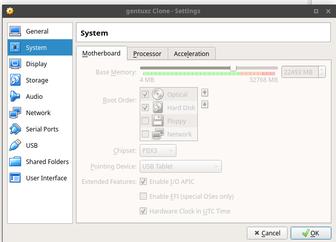

> 
 enable processor "true cores".

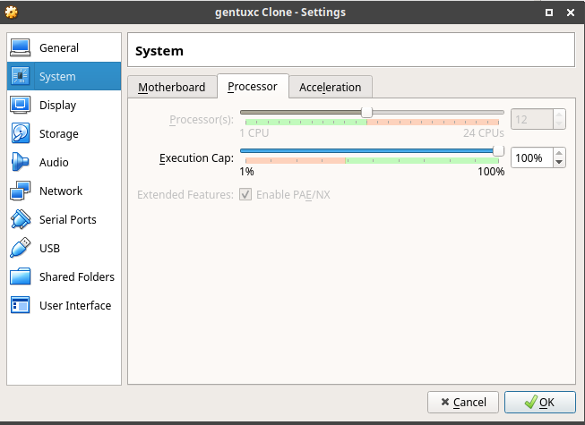

> 
 KVM acceleration for the virt.

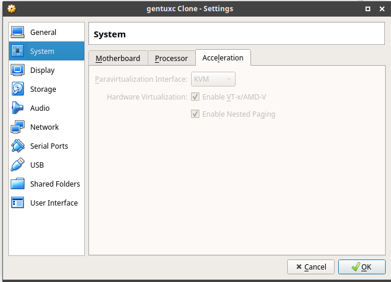

> 
 add screen memory.

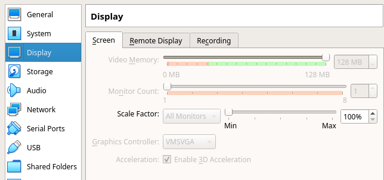

> 
 mount CD rom img as IDE. 

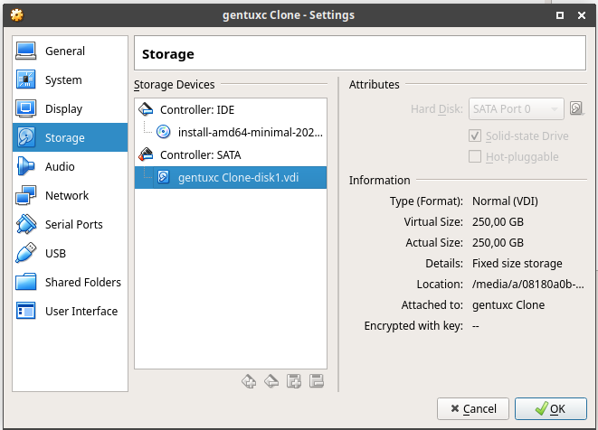

> 
 samplenetwork ->  HOST bridged to br0 ipv4 only.

## GET STARTED

### Prepare the guest

> 
virtualbox main window after boot of the minimal image.

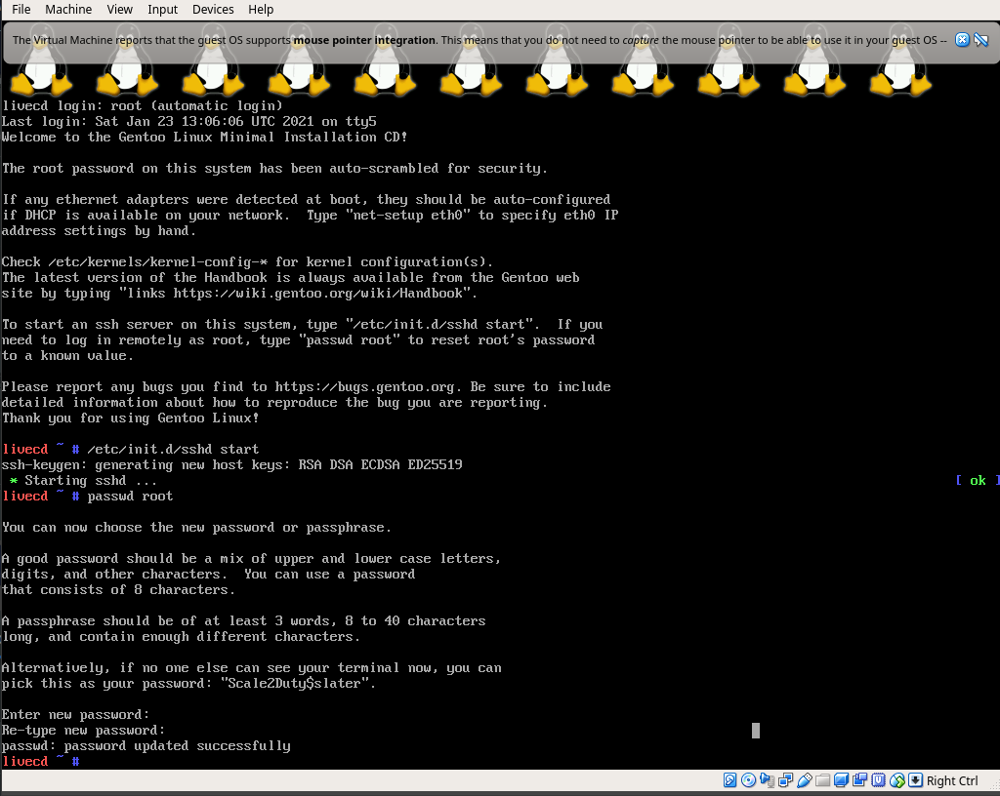

> 
set variables / functions in the setup script. define which functions to run.

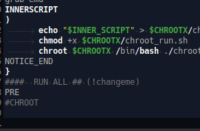

> 
virtbualbox net.

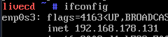

> 
transfer the configured script with the functions to run enabled to the guest.

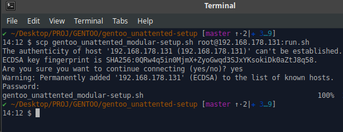

> 
make the script exec.

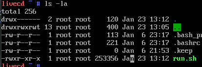

> 
run PRE ... continue with a ready partitioned and configured chroot.

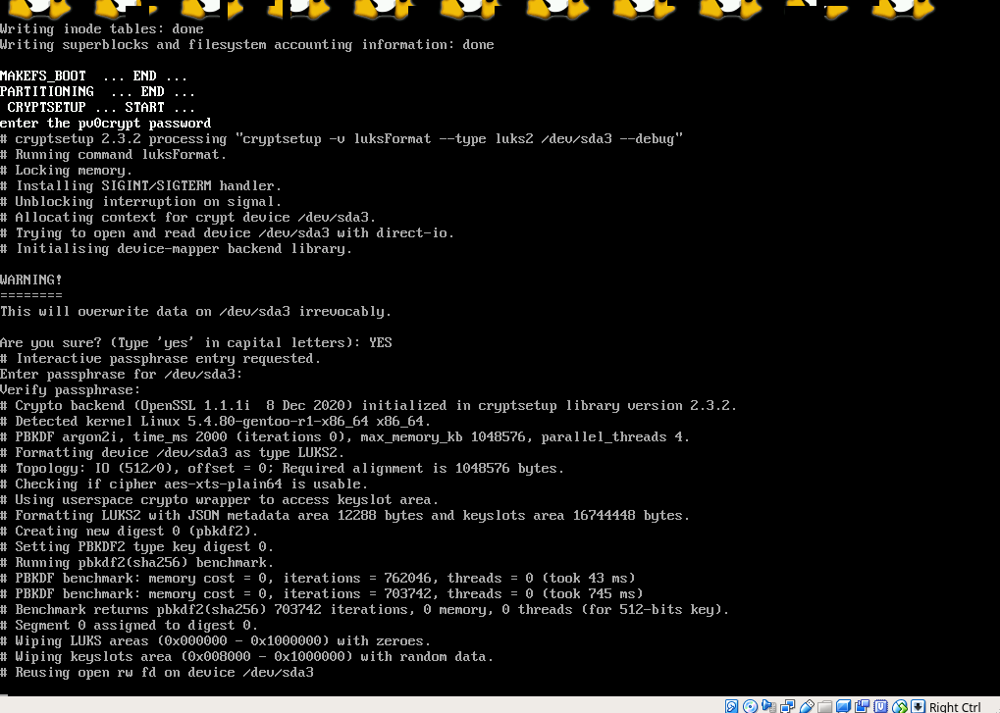

> 
there are (possible) 3 interruptions during the script ... the first is for the drive encryption (if turned on) (screenshot), 2nd for the kernel config and the 3rd for the user passwoord setup.

> 
it might be fortunate to run every section on its own and safe progress with virtualbox clones .. most of config parsing etc is automatically overwritten if a function is run twice.

> 
work in progress....
