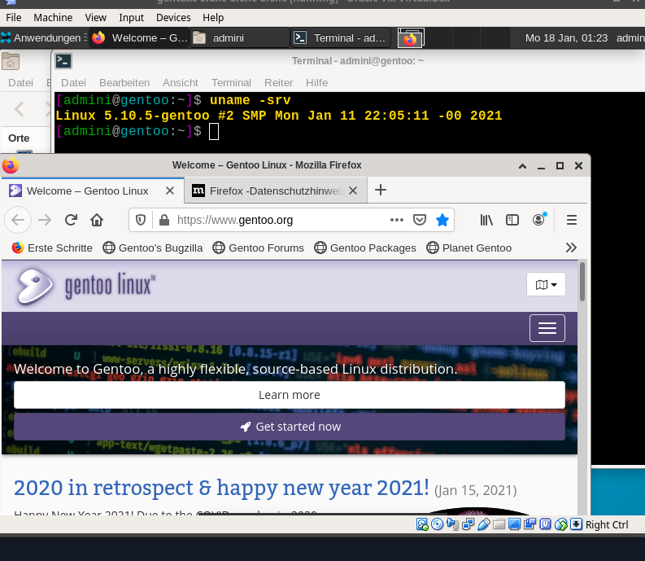

# Automated, modular - 1 file - setup for GENTOO linux.
- 1 file configurable setup script for a automated - unattended & modular gentoo linux system installation. 
> all infos in the script file!

## EX: Virtualbox (> v6.*).
> have plenty of RAM, compensate for lack of RAM with SWAP (CHROOT).

> enable processor "true cores" .

> KVM as virt in order to make the hardware available in the virtual-machine.

> add screen memory.

> mount CD rom img as IDE, set SSD mark if ... (add space for swap CHROOT if req.) 

> samplenetwork -> ssh host to guest: HOST bridged to br0 ipv4 only. (wrong adapter type may prevent coonnect) | ssh ...

## GET STARTED

### Prepare the guest

> virtualbox main window after boot of the minimal image. 

> set variables functions in the setup script. define which functions to run ... here we only run the PRE function.... always find the wrapped up function run on the bottom of the function stack.

> virtbualbox net.

> transfer the configured script with the functions to run enabled to the guest.

> make the script exec.

> run PRE ... continue with a ready partitioned and configured chroot.

> there are (possible) 3 interruptions during the script ... the first is for the drive encryption (if turned on) (screenshot), 2nd for the kernel config and the 3rd for the user passwoord setup.

> it might be fortunate to run every section on its own and safe progress with virtualbox clones .. most of config parsing etc is automatically overwritten if a function is run twice.

> work in progress....
