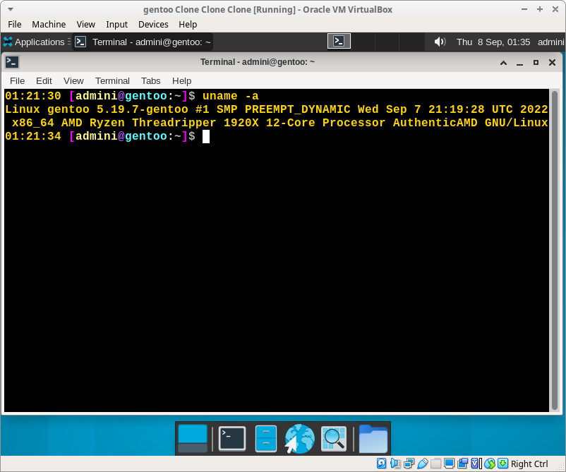

# Automated modular GENTOO linux setup

# status 07.09.2022 .. boots to desktop, firefox build fail.

> testing ... functions may but commented out ;)
- work / redo / TESTING all the things ... things maybe not ordered neatley yet.
- basic mockup, work in progress
- script runs with "very little" interaction required to setup a gentoo desktop. ... testing

DOCS: https://github.com/alphaaurigae/gentoo_unattented-setup/tree/master/doc

> 
screen

