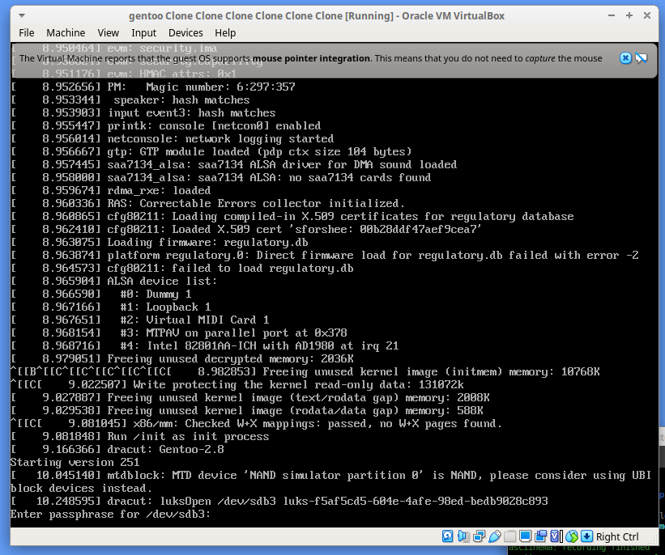
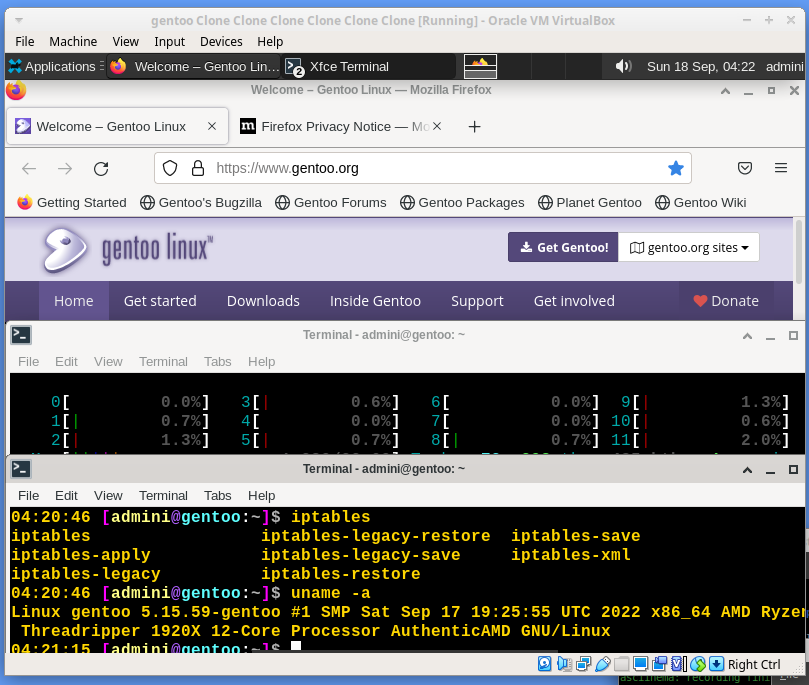

# Automated modular GENTOO linux setup

# status 17.09.22
> Files for chroot and pre functions located in src/PRE src/CHROOT.
> Easy functions ON OFF gentoo_unattented-setup/run.sh
- updated https://github.com/alphaaurigae/gentoo_unattented-setup/blob/master/var/chroot_variables.sh during test setup but shouldn`t produce errors - minor.

## Get started
1. Adjust var/* - default is cryptsetup / cryptsetup off works too for lvm on root. Default set as outlined below.
2. Adhust run.sh functions to run parts - useful for debugging and backup state of VM.
3. rsync reporoot to serv / chroot; sample script in script/.
4. ssh to serv || vm; cd reporoot; ./run.sh - repeat 3 & 4 as needed ...
- Sample setup on Virtualbox VM with bridged adaper. (Sample bridge setup in sript/)
> PRE with CRYPTSETUP="YES" - CRYPTSETUP="NO" == LVM on root (successful previous test - https://github.com/alphaaurigae/gentoo_unattented-setup/blob/master/var/var_main.sh

- asciinema recording of PRE setup:

- CHROOT logs attached in logdir https://github.com/alphaaurigae/gentoo_unattented-setup/tree/master/dev_log  |  no signifcant errors - last testrun
> Boots to desktop xfce -> firefox, network, audio ...
- Basic mockup, work in progress
- Script runs with "very little" interaction required to setup a gentoo desktop. See logs.

DOCS (maybe dated - this page is updated first): https://github.com/alphaaurigae/gentoo_unattented-setup/tree/master/doc
> 
crypt boot

> 
booted gentoo VM lxdm - xfce

## Default (main testing)
- OPENRC
> .bashrc, kernel.conf cp during setup from configs/ https://github.com/alphaaurigae/gentoo_unattented-setup/tree/master/configs
> Variables:  https://github.com/alphaaurigae/gentoo_unattented-setup/tree/master/var
> Amd 1920 and m.2 ssd with other load while building for full default setup +9h on Vbox KVM.
> Vbox sample setup /home/a/Desktop/testing_dev/main/gentoo_unattented-setup/img/screenshots/virtual_machine/virtualbox/

### PRE

#### PARTITIONING
> https://github.com/alphaaurigae/gentoo_unattented-setup/blob/master/src/PRE/PARTITIONING.sh
> testing on 240gb VM, may requires less...
- sda single drive setup (240gb on test, may use way less...)
- sda1 bios boot
- sda2 bios boot - fs ext2
- sda3 main part - fs ext4 - lvm on cryptsetup or alt lvm on root

#### STAGE3
> https://github.com/alphaaurigae/gentoo_unattented-setup/blob/master/src/PRE/STAGE3.sh
- curl off http://distfiles.gentoo.org/releases/amd64/autobuilds/
- GPG verify and print err if. 
- unpack to chroot

#### PREP CHROOT
> bottom --> https://github.com/alphaaurigae/gentoo_unattented-setup/blob/master/run.sh
- copy files for chroot

### CHROOT
#### BASE
> https://github.com/alphaaurigae/gentoo_unattented-setup/tree/master/src/CHROOT/BASE
- SWAPFILE - 50gb + 28gb test vm ram
- MAKECONF 
- CONF_LOCALES
- PORTAGE
- ESELECT_PROFILE - profile 1 stable . var/ PRESET_ACCEPT_KEYWORDS="amd64" default | "amd64 ~amd64" - build 7.9.22 
- EMERGE_ATWORLD
- SYSTEMTIME - openntpd
- KEYMAP_CONSOLEFONT - def /etc/conf.d/keymaps, /etc/conf.d/consolefont, x11 X11/xorg.conf.d/10-keyboard.conf - dracut load for cryptset.
- FIRMWARE - linux firware default gentoo
- CP_BASHR

#### CORE
> https://github.com/alphaaurigae/gentoo_unattented-setup/tree/master/src/CHROOT/CORE
- FSTAB
- SYSFS = DMCRYPT, LVM, MULTIPATH
- FSTOOLS = ext2
- SUDO
- SYSLOG - syslogng
- SYSAPP - pciutils, mlocate
- APP - gnupg
- SYSPROCESS, CRON cronie (unfinished set, TOP
- KERNEL - gentoo-sources , premade config for vm cryptsetup
- INITRAM - dracut
- BOOTLOADER grub2 - osprober
- EMULATION - virtualbox guest add (test on virtualbox kvm setting)
- SOUND_API - alsa
- SOUND_SERVER jack2, pulseaudio
- SOUND_MIXER pavucontrol
- GPU - virtualbox guest
- NET_MGMT, netirfc, dhcpcd, networkmanager
- NET_FIREWALL - iptables

#### SCREENDSP
> https://github.com/alphaaurigae/gentoo_unattented-setup/tree/master/src/CHROOT/SCREENDSP
- WINDOWSYS - x11
- DESKTOP_ENV - xfce4
- MGR - LXDM

#### USERAPP - git, firefox
> https://github.com/alphaaurigae/gentoo_unattented-setup/tree/master/src/CHROOT/USERAPP
- firefox and dep libwebp take DECENT CPU TIME!!!! and require space +15gb - more time than updateworld portage & kernel... but you get the full source compiled ^^...
- chromium and oher alternatives not tested yet.

#### USERS
> https://github.com/alphaaurigae/gentoo_unattented-setup/tree/master/src/CHROOT/USERS
- root pw
- add groups
- add admin, add admin to groups
- addvirtualbox vbox groups, add admin to vbox groups
