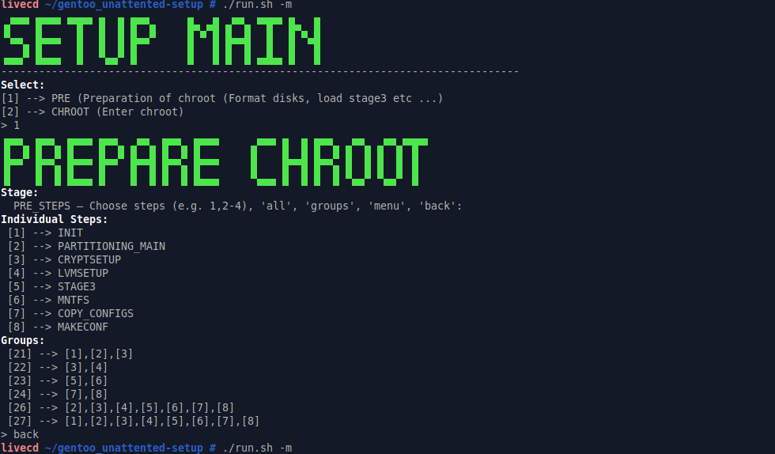
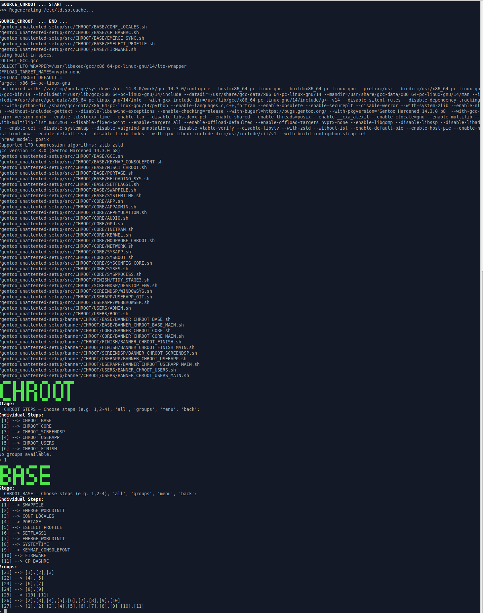
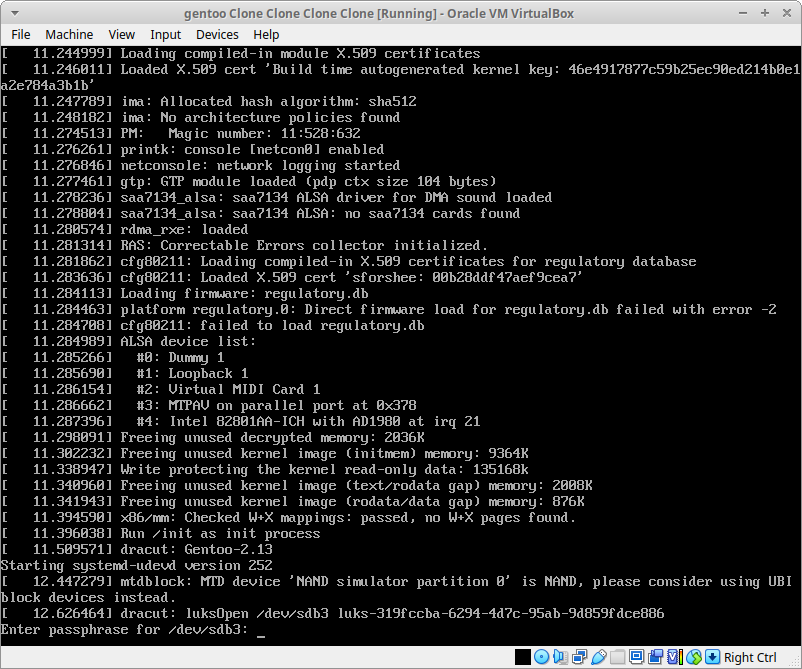
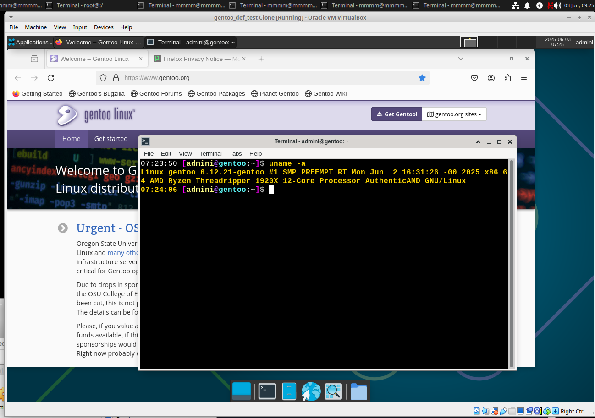

# "Modular Gentoo Linux Setup
Automated/semi-automated chroot to simplify customization, scaling, cloning, and testing."
- ( Password prompts for cryptsetup, users and GPG setup)

## Status 13.06.25

- Temp update ... yet to test the full setup!
- New setup file newrun.sh, dynmic menu, bugfixes, tidy .... 

## Status 04.06.25

> Setup runs from start to end with default settings LVM root and cryptsetup root - both (CRYPTSETUP=YES/NO in var_main.sh)

### Doc
doc/Readme.md

### Menu [15.06.2025]
> 
PREPARE CHROOT STEP MENU

> 
RUN CHROOT STEP MENU

### Sample [15.06.2025]
- asciinema MEMU guided setup example:

- asciinema NO MENU "semi automated" (needs prompts for optional: cryptsetup, GPG, kernel menuconfig

( Dated - this page is updated first): https://github.com/alphaaurigae/gentoo_unattented-setup/tree/master/doc
> 
crypt boot

> 
booted gentoo VM lxdm - xfce

