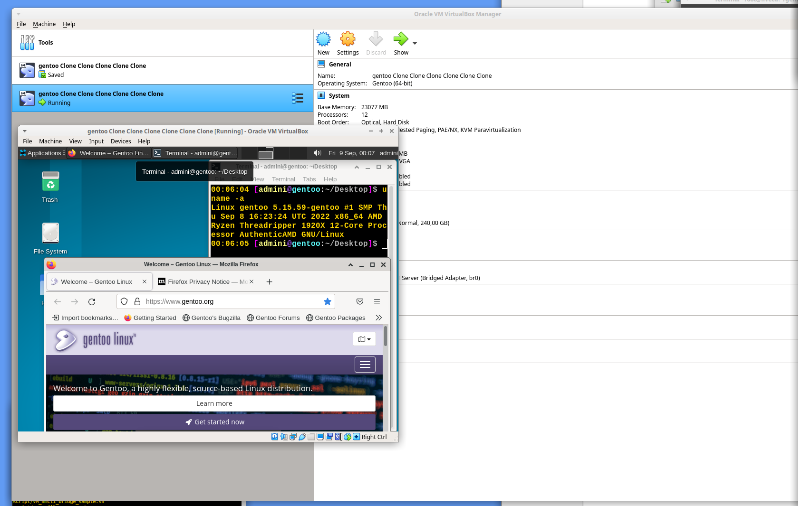

# Automated modular GENTOO linux setup

# status 08.09.2022 .. 
> grub setup rerun on end, else boot failed
> boots to desktop xfce -> firefox, network, audio ...
> no significant errors, logs attached log dir
- PRESET_ACCEPT_KEYWORDS="amd64" # build 8.9.22 "amd64 ~amd64" - build 7.9.22 # ~amd64" # alone not tested yet # all on profile 1
> testing ... functions may but commented out ;)
- work / redo / TESTING all the things ... things maybe not ordered neatley yet.
- basic mockup, work in progress
- script runs with "very little" interaction required to setup a gentoo desktop. ... testing
- bugs that prevented the script to run to the finish (desktop environment) removed ... xfce deskop boots.

DOCS: https://github.com/alphaaurigae/gentoo_unattented-setup/tree/master/doc

> 
screen

