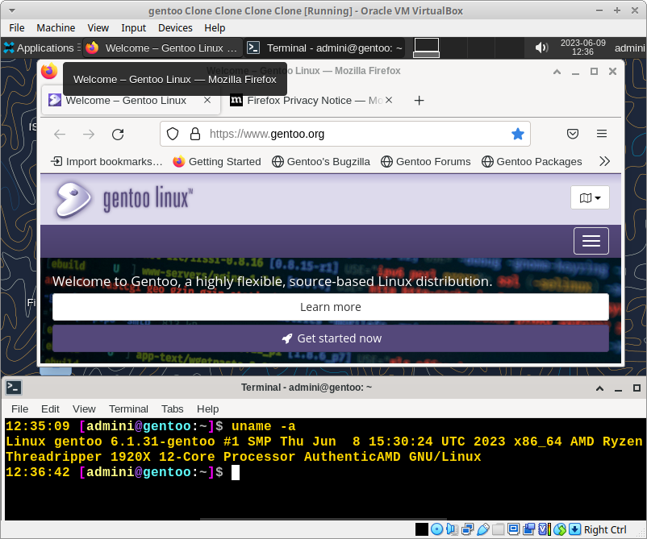

# Automated modular GENTOO linux setup

## Status latest 27.05.25.

> DEFAULT CRYPTSETUP WITH ARGON2 ON GRUB WITH BIOS BROKEN ... need fix
https://man7.org/linux/man-pages/man8/cryptsetup-luksFormat.8.html
https://www.cryptolux.org/index.php/Argon2
https://wiki.gentoo.org/wiki/Rootfs_encryption#Create_the_LUKS_encrypted_partition
https://leo3418.github.io/collections/gentoo-config-luks2-grub-systemd/packages.html

1. Updated stage3 fetch regex.
2. Updated default var config to eselect profile [41] "23.0/hardened (stable)"
3. Tidy run.sh - headers and menu.
4. Updated make.conf var preset for features - removed "cgroup"
5. Switched default march flag to native. Temp added -mfma -mavx2 to default build flags.
6. replace dracutmodules add_dracutmodules in dracut.conf

> Firefox build fail if march set to native, need to verify. 

W. firefox disk +82GB req.

## Get started
1. Adjust var/* 
- Default is cryptsetup ON! Cryptsetup off works too for LVM on root.
2. Adjust run.sh functions to run parts - useful for debugging and backup state of VM.
3. rsync reporoot to serv / chroot; 
- Sample 'script' 'copy_files_rsync.sh' in script/.
4. If serv || vm  ssh root@192.168.178.99 && cd gentoo_unattented-setup && ./run.sh` .... repeat rsync if sections run separately ie PRE, CHROOT
- Sample setup on Virtualbox VM with bridged adaper. (Sample bridge setup in sript/)
> PRE with CRYPTSETUP="YES" - CRYPTSETUP="NO" == LVM on root (successful previous test - https://github.com/alphaaurigae/gentoo_unattented-setup/blob/master/var/var_main.sh

- asciinema recording of PRE setup (Dated vid but still mostly the same - update todo):

- asciinema CHROOT sample (just the start as sample, else its wayy to long obv)

- (note dated, not updated last tests) CHROOT logs attached in logdir https://github.com/alphaaurigae/gentoo_unattented-setup/tree/master/dev_log  |  no signifcant errors - last testrun
> Boots to desktop xfce -> firefox, network, audio ...
- Basic mockup, work in progress
- Script runs with "very little" interaction required to setup a gentoo desktop. See logs.

DOCS ( dated - this page is updated first): https://github.com/alphaaurigae/gentoo_unattented-setup/tree/master/doc
> 
crypt boot

> 
booted gentoo VM lxdm - xfce

## Default (main testing)
- OPENRC
> .bashrc, kernel.conf cp during setup from configs/ https://github.com/alphaaurigae/gentoo_unattented-setup/tree/master/configs
> Variables:  https://github.com/alphaaurigae/gentoo_unattented-setup/tree/master/var
> Amd 1920 and m.2 ssd with other load while building for full default setup +9h on Vbox KVM.
> Vbox sample setup /home/a/Desktop/testing_dev/main/gentoo_unattented-setup/img/screenshots/virtual_machine/virtualbox/

### PRE

#### PARTITIONING
> https://github.com/alphaaurigae/gentoo_unattented-setup/blob/master/src/PRE/PARTITIONING.sh
> Testing on 240gb VM, may requires less...
- sda single drive setup (240gb on test, may use way less...)
- sda1 bios boot
- sda2 bios boot - fs ext2
- sda3 main part - fs ext4 - lvm on cryptsetup or alt lvm on root

#### STAGE3
> https://github.com/alphaaurigae/gentoo_unattented-setup/blob/master/src/PRE/STAGE3.sh
- curl off http://distfiles.gentoo.org/releases/amd64/autobuilds/
- GPG verify and print err if. 
- unpack to chroot

#### PREP CHROOT
> Bottom --> https://github.com/alphaaurigae/gentoo_unattented-setup/blob/master/run.sh
- copy files for chroot

### CHROOT
#### BASE
> https://github.com/alphaaurigae/gentoo_unattented-setup/tree/master/src/CHROOT/BASE
- SWAPFILE - 50gb + 28gb test vm ram
- MAKECONF 
- CONF_LOCALES
- PORTAGE
- ESELECT_PROFILE - profile 1 stable . var/ PRESET_ACCEPT_KEYWORDS="amd64" default | "amd64 ~amd64" - build 7.9.22 
- EMERGE_ATWORLD
- SYSTEMTIME - openntpd
- KEYMAP_CONSOLEFONT - def /etc/conf.d/keymaps, /etc/conf.d/consolefont, x11 X11/xorg.conf.d/10-keyboard.conf - dracut load for cryptset.
- FIRMWARE - linux firware default gentoo
- CP_BASHR

#### CORE
> https://github.com/alphaaurigae/gentoo_unattented-setup/tree/master/src/CHROOT/CORE
- FSTAB
- SYSFS = DMCRYPT, LVM, MULTIPATH
- FSTOOLS = ext2
- SUDO
- SYSLOG - syslogng
- SYSAPP - pciutils, mlocate
- APP - gnupg
- SYSPROCESS, CRON cronie (unfinished set, TOP
- KERNEL - gentoo-sources , premade config for vm cryptsetup
- INITRAM - dracut
- BOOTLOADER grub2 - osprober
- EMULATION - virtualbox guest add (test on virtualbox kvm setting)
- SOUND_API - alsa
- SOUND_SERVER jack2, pulseaudio
- SOUND_MIXER pavucontrol
- GPU - virtualbox guest
- NET_MGMT, netirfc, dhcpcd, networkmanager
- NET_FIREWALL - iptables

#### SCREENDSP
> https://github.com/alphaaurigae/gentoo_unattented-setup/tree/master/src/CHROOT/SCREENDSP
- WINDOWSYS - x11
- DESKTOP_ENV - xfce4
- MGR - LXDM

#### USERAPP - git, firefox
> https://github.com/alphaaurigae/gentoo_unattented-setup/tree/master/src/CHROOT/USERAPP
- firefox and dep libwebp take DECENT CPU TIME!!!! and require space +15gb - more time than updateworld portage & kernel... but you get the full source compiled ^^...
- chromium and oher alternatives not tested yet.

#### USERS
> https://github.com/alphaaurigae/gentoo_unattented-setup/tree/master/src/CHROOT/USERS
- root pw
- add groups
- add admin, add admin to groups
- addvirtualbox vbox groups, add admin to vbox groups

### How the it works:
1.0 run.sh is the executeable file to run the scriptset.

1.1 If run.sh is run with -a it will launch the unattended setup, if launched with -m the simple bash menu will guide through the steps which is useful for testing outlined in the -h.

1.1 run.sh first sourcing func/func_main.sh (main functions used in PRE and CHROOT (sourced in chroot again)), var/var_main.sh (main variables for PRE and CHROOT (has to be sourced for chroot again in innserscript) )&& var/1_PRE_main.sh (PRE variables) at the start.

1.2 PRE: source /gentoo_unattented-setup/src/PRE/* functions & run in order defined in run.sh.

1.3 CHROOT: copy the entire gentoo_unattented-setup/ dir to chroot (CP_CHROOT function) as chroot was created in PRE, echo innerscript $CHROOTX/chroot_main.sh and execute it with chroot 

... the script then sources the chroot and main functions and variables as well as the /gentoo_unattented-setup/src/CHROOT/* functions (per section (base,core etc)) and either run with menu steps if run.sh -m or just loop through every section if run.sh run with -a.

> Comments for the variable & script interactions partly added, most important to start is checking the var/* variables, most if not everything to be adjusted there,
