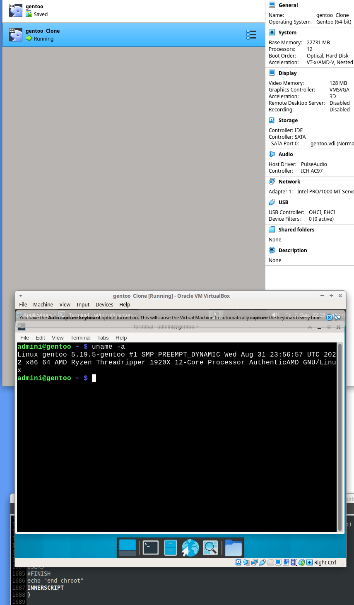

# Automated modular GENTOO linux setup

# status 05.09.2022

## kernel doesent compile .... 
> kernel setup BUG: https://forums.gentoo.org/viewtopic-p-8742904.html?sid=6cae39809debda9a7e670fb4a4ef2cf5

- PRE no errors
- CORE -> BASE no errors
- KERNEL ERR bug

- work / redo / TESTING all the things ... things maybe not ordered neatley yet.
- basic mockup, work in progress
- script runs with "very little" interaction required to setup a gentoo desktop. ... testing
- bugs that prevented the script to run to the finish (desktop environment) removed ... xfce deskop boots.

DOCS: https://github.com/alphaaurigae/gentoo_unattented-setup/tree/master/doc

> 
booted box on first full test .. work in progress

